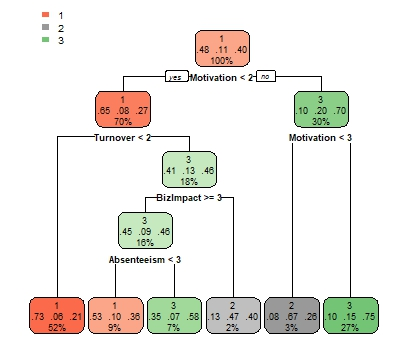
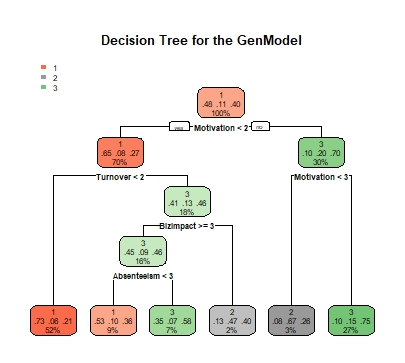
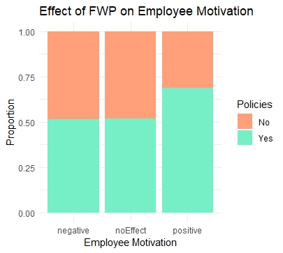

# 📘 Effectiveness of Flexible Working Practices (FWPs)  
**Impact of Flexible Working on Organisational Productivity in the UK**

---

## 🔍 Project Overview

This project analysed secondary data from the **Fourth Work-Life Balance Survey of Employers (WLB4)** to examine how **Flexible Working Practices (FWPs)** influence organisational productivity in UK profit-driven businesses. The analysis explored employee behaviours such as **motivation**, **turnover**, and **absenteeism** as mediating factors, using both classical and machine learning methods.

---

## 💡 Objectives & Tasks

- Extracted and cleaned a subset of **1,388 records** from profit-oriented organisations
- Conducted **descriptive** and **exploratory statistical analysis** to identify trends and relationships
- Built and validated an **ordinal logistic regression model** to assess the link between FWPs and productivity
- Developed **decision tree** and **random forest models** to predict productivity using FWPs and behavioural variables
- Performed **feature importance analysis** to identify the most impactful predictors
- Interpreted findings using **Contingency Theory** to understand context-dependent results

---

## 📈 Key Findings

- **FWPs significantly enhance productivity**, largely by:
  - Reducing staff turnover and absenteeism
  - Increasing employee motivation
- **Medium-sized firms** benefit more than smaller firms from FWPs
- **Role suitability** and presence of **formal flexible working policies** are critical to achieving productivity gains
- Demonstrated the practical value of combining **statistical modelling** with **machine learning** in organisational research

---

## 🧰 Tools & Techniques

- **Excel** – Initial data review and basic summaries
- **R / RStudio** – Main analysis and modelling
  - Libraries: `ggplot2`, `randomForest`, `ordinal`
  - Techniques:
    - Ordinal Logistic Regression
    - CART (Classification and Regression Trees)
    - Random Forest
    - Pearson Correlation Analysis
    - Feature Importance Visualization

---

## 🎯 Skills Demonstrated

- Applied **quantitative methods** to organisational behaviour research
- Strengthened expertise in **regression modelling**, **classification models**, and **data visualisation**
- Delivered actionable insights with **business relevance**
- Practiced model interpretation and theory-backed explanation

---

## 🖼️ Optional Visuals

> 📷 Add screenshots or model outputs here to support visual storytelling, e.g.:

```markdown







